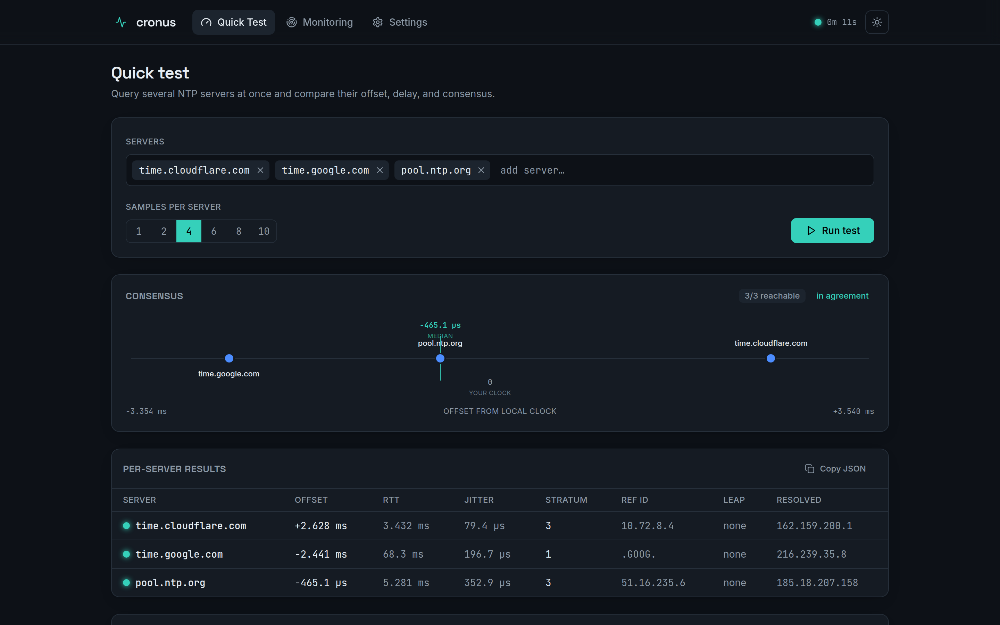
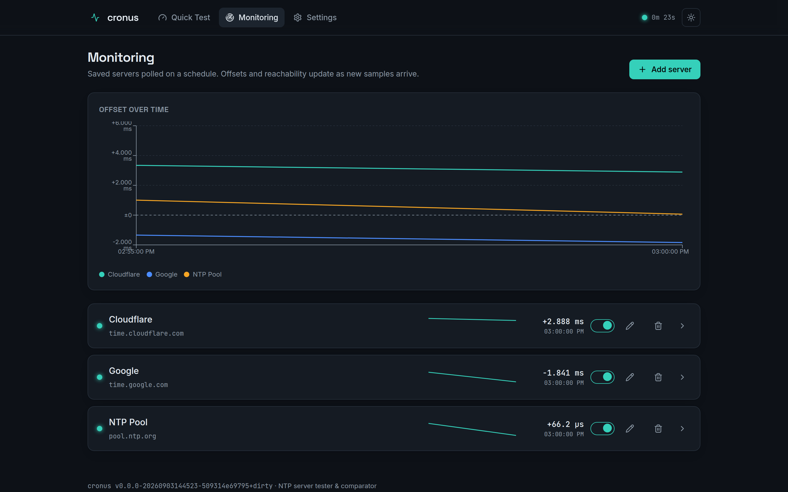
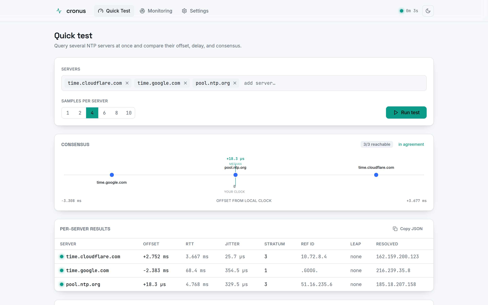
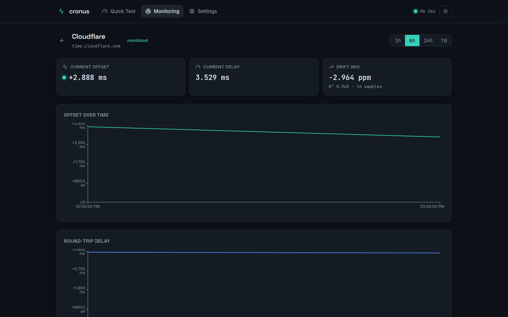
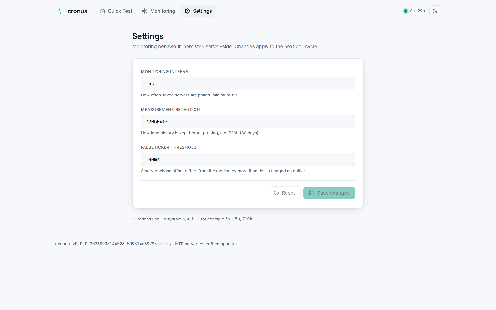

# Cronus

**NTP server tester and comparator.** Query multiple NTP servers, compare their
responses side by side, and track clock offset and drift over time — all from a
modern, self-hosted web UI (and a single static binary).

[](https://github.com/t0mer/cronus/releases)
[](LICENSE)
[](https://hub.docker.com/r/techblog/cronus)
[](https://github.com/t0mer/cronus/actions/workflows/ci.yml)

---

## What it does

Cronus has two modes:

1. **On-demand test** — enter one or more NTP servers and Cronus queries each
   with N samples, then shows a side-by-side comparison: offset, round-trip
   delay, jitter, stratum, reference ID, leap indicator, and the resolved IP
   that answered. A **consensus ruler** plots every server on a shared offset
   axis so agreement — and falsetickers — read at a glance.
2. **Continuous monitoring** — save servers and poll them on a schedule. Cronus
   stores the history and renders offset-over-time, round-trip-delay, and drift
   (ppm) charts, so you can watch how sources behave and diverge — e.g.
   validating a local chrony container against `time.cloudflare.com`.

It computes median **consensus** across servers, flags **falsetickers** that
deviate beyond a threshold, measures **jitter** across samples, estimates
**drift** by linear regression over the stored history, and shows the
**pairwise delta matrix** between servers.

### Quick Test



The consensus ruler and per-server comparison table, with the pairwise delta
matrix a click away.

### Monitoring



Saved servers polled on a schedule, with a multi-server offset overlay and
per-server sparklines.

### Light mode & mobile

Cronus is responsive down to 360px and follows your system light/dark
preference (with a manual toggle).

| Quick Test (light) | Server detail | Settings |
|---|---|---|
|  |  |  |

## Run it

### Docker

```bash
docker run -d --name cronus \
  -p 8080:8080 \
  -v cronus-data:/data \
  techblog/cronus:latest
```

Open http://localhost:8080. The image is a ~17 MB `scratch` container running as
a non-root user; only outbound UDP/123 is needed.

### docker-compose

```yaml
services:
  cronus:
    image: techblog/cronus:latest
    ports: ["8080:8080"]
    volumes:
      - cronus-data:/data     # SQLite DB + history — persist it
    environment:
      LOG_LEVEL: info
    restart: unless-stopped
volumes:
  cronus-data:
```

Cronus pairs well with a local NTP server (e.g. `cturra/ntp` or a chrony
container) so you can validate your LAN time source against public servers. See
[`docker-compose.yml`](docker-compose.yml).

### CLI

The same binary is a one-shot tester:

```bash
cronus test time.cloudflare.com time.google.com pool.ntp.org --deltas
cronus test time.cloudflare.com --json
```

## Configuration

Precedence (highest first): **command-line flags → environment variables →
`config.yaml` → built-in defaults**. Environment variables use the `CRONUS_`
prefix with nested keys joined by underscores.

| YAML key | Env var | Default | Description |
|---|---|---|---|
| `listen` | `CRONUS_LISTEN` | `:8080` | HTTP listen address |
| `db.path` | `CRONUS_DB_PATH` | `/data/cronus.db` | SQLite database path |
| `ntp.samples` | `CRONUS_NTP_SAMPLES` | `4` | Samples per server per run (1–10) |
| `ntp.timeout` | `CRONUS_NTP_TIMEOUT` | `5s` | Per-query timeout |
| `ntp.workers` | `CRONUS_NTP_WORKERS` | `8` | Parallel server queries |
| `monitor.interval` | `CRONUS_MONITOR_INTERVAL` | `5m` | Scheduled poll interval (floor 15s) |
| `monitor.retention` | `CRONUS_MONITOR_RETENTION` | `720h` | Measurement retention |
| `compare.outlier_threshold` | `CRONUS_COMPARE_OUTLIER_THRESHOLD` | `100ms` | Falseticker flag threshold |
| `log.level` | `CRONUS_LOG_LEVEL` | `info` | Log level: `debug`/`info`/`warning`/`error` |

The monitoring interval, retention, and outlier threshold are also editable at
runtime from the **Settings** page (persisted server-side) and take effect on
the next poll cycle. See [`config.example.yaml`](config.example.yaml).

### CLI flags & subcommands

| Command | Purpose |
|---|---|
| `cronus serve` (default) | Run the HTTP server and monitoring scheduler |
| `cronus test <server…>` | One-shot comparison; `--samples`, `--json`, `--deltas` |
| `cronus version` / `--version` | Print the build version |
| `cronus healthcheck` | Probe local `/healthz` (used by the container HEALTHCHECK) |

Root flags: `--config`, `--listen`, `--db.path`, `--log.level`.

## API

Every UI action maps to a documented REST endpoint under `/api/v1`. See
[`docs/API.md`](docs/API.md). Highlights:

- `POST /api/v1/test` — run an on-demand comparison
- `GET/POST/PUT/DELETE /api/v1/servers` — manage monitored servers
- `GET /api/v1/servers/{id}/measurements` — history (with downsampling)
- `GET /api/v1/servers/{id}/drift` — drift (ppm) over a window
- `GET /api/v1/status`, `GET /healthz`

## Metrics

Prometheus metrics at `GET /metrics`. Per-monitored-server gauges are labelled
`{id, server}`:

| Metric | Type | Description |
|---|---|---|
| `cronus_offset_seconds` | gauge | Clock offset vs. local, seconds |
| `cronus_rtt_seconds` | gauge | Round-trip delay, seconds |
| `cronus_jitter_seconds` | gauge | Offset jitter across samples, seconds |
| `cronus_stratum` | gauge | Reported stratum |
| `cronus_reachable` | gauge | 1 reachable, 0 not, at last poll |
| `cronus_polls_total` | counter | Monitoring poll cycles |
| `cronus_measurements_pruned_total` | counter | Measurements pruned by housekeeping |
| `cronus_last_poll_timestamp_seconds` | gauge | Unix time of last poll |
| `cronus_monitored_servers` | gauge | Enabled servers at last poll |

## Build from source

Requires Go 1.25+ and Node 20+.

```bash
# Frontend (embedded into the binary)
cd web && npm ci && npm run build && cd ..

# Static binary
CGO_ENABLED=0 go build -trimpath \
  -ldflags "-s -w -X github.com/t0mer/cronus/internal/version.Version=dev" \
  -o dist/cronus ./cmd/cronus
```

Or use the Makefile: `make build` (builds the frontend then the binary),
`make test`, `make run`, `make docker`, `make release-dry`. For local dev with
hot reload: `./scripts/dev.sh` (backend on `:8080`, Vite on `:5173`).

## Tech

Single static Go binary with an embedded React/Vite/TypeScript SPA. NTP via
[`beevik/ntp`](https://github.com/beevik/ntp), routing via
[`chi`](https://github.com/go-chi/chi), storage via pure-Go
[`modernc.org/sqlite`](https://pkg.go.dev/modernc.org/sqlite) (CGO-free),
charts via [`recharts`](https://recharts.org). Multi-arch images
(`linux/amd64`, `arm64`, `arm/v7`).

## License

[Apache-2.0](LICENSE).
