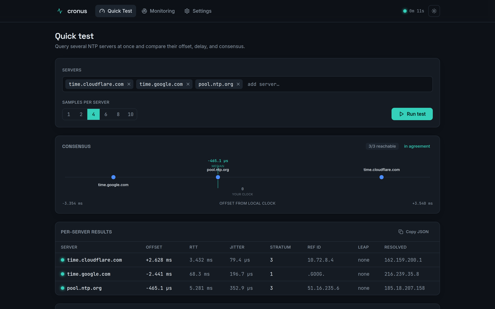
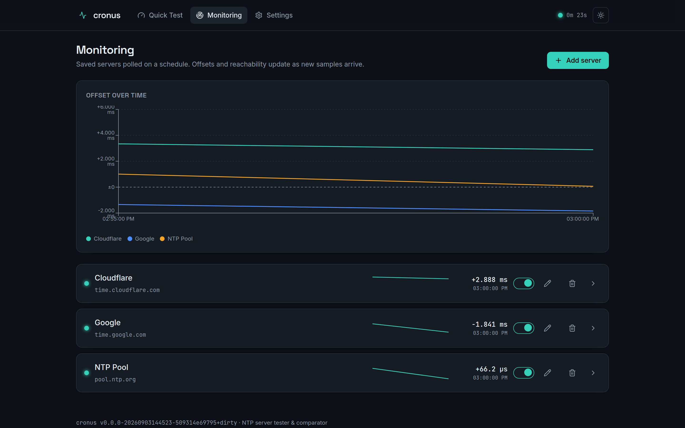
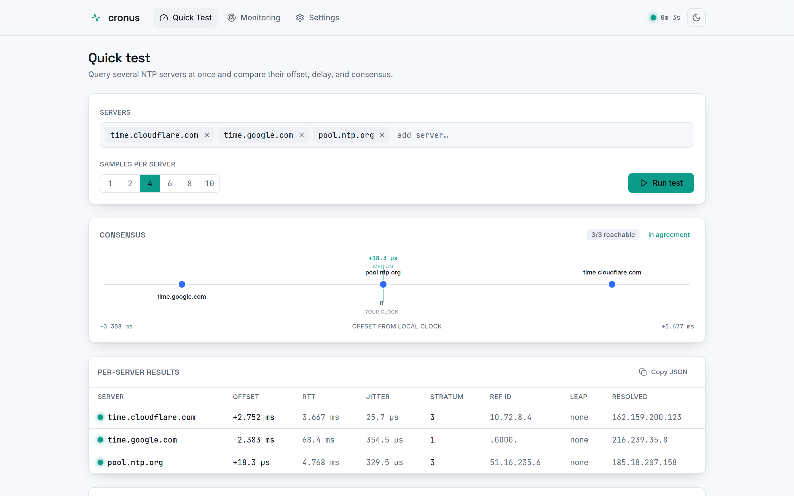
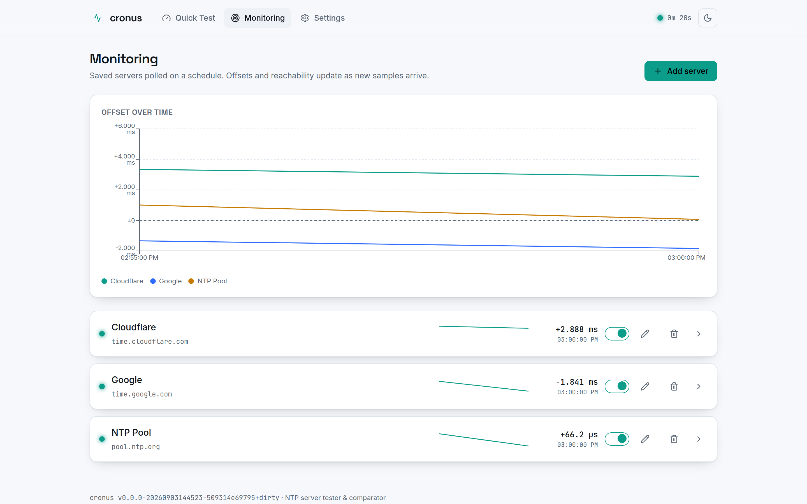
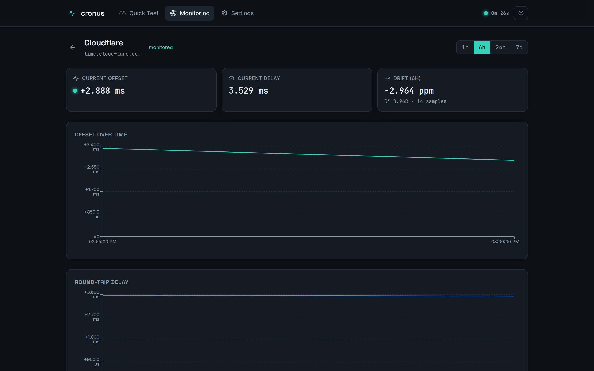
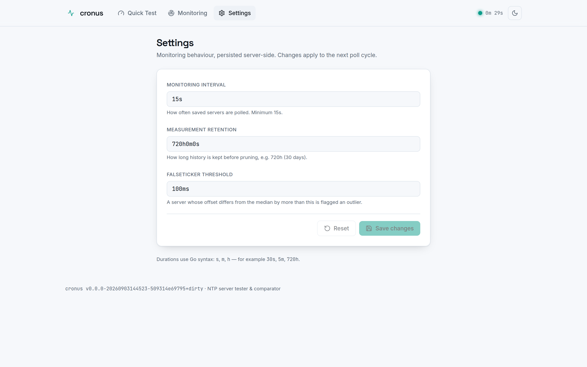
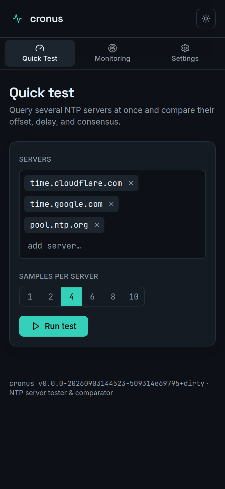
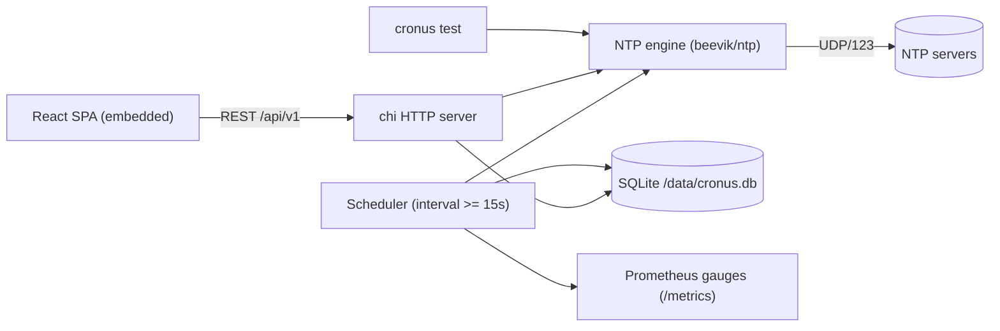

# Cronus

**NTP server tester and comparator.** Query multiple NTP servers, compare their
responses side by side, and track clock offset and drift over time, all from a
modern, self-hosted web UI (and a single static binary).

[](https://github.com/t0mer/cronus/releases)
[](LICENSE)
[](https://hub.docker.com/r/techblog/cronus)

---

## Contents

- [What it does](#what-it-does)
- [Features](#features)
- [Screenshots](#screenshots)
- [How it works](#how-it-works)
- [Requirements](#requirements)
- [Run it](#run-it)
- [Configuration](#configuration)
- [Usage](#usage)
- [API](#api)
- [Metrics](#metrics)
- [Security notes](#security-notes)
- [Troubleshooting](#troubleshooting)
- [Development](#development)
- [Tech](#tech)
- [Contributing](#contributing)
- [License](#license)

## What it does

Cronus has two modes:

1. **On-demand test**: enter one or more NTP servers and Cronus queries each
   with N samples, then shows a side-by-side comparison of offset, round-trip
   delay, jitter, stratum, reference ID, leap indicator, and the resolved IP
   that answered. A **consensus ruler** plots every server on a shared offset
   axis, so agreement (and falsetickers) can be read at a glance.
2. **Continuous monitoring**: save servers and poll them on a schedule. Cronus
   stores the history and renders offset-over-time and round-trip-delay charts
   plus a drift (ppm) estimate, so you can watch how sources behave and diverge. For example,
   you can validate a local chrony container against `time.cloudflare.com`.

It computes the median **consensus** across servers, flags **falsetickers** that
deviate beyond a threshold, measures **jitter** across samples, estimates
**drift** by linear regression over the stored history, and shows the
**pairwise delta matrix** between servers.

## Features

- **Multi-server comparison**: up to 20 servers per on-demand test, each given
  as `host`, `host:port`, an IPv6 literal, or `[ipv6]:port` (port defaults to
  `123`).
- **Per-server metrics**: offset and RTT are taken from the lowest-delay
  successful sample (the standard NTP choice). Jitter is the standard deviation
  of all successful sample offsets. Stratum, reference ID, leap indicator,
  precision, root delay, and root dispersion are also reported.
- **Resolved IP tracking**: DNS is resolved at query time and the answering IP
  is recorded, so you can see which pool member replied.
- **Kiss-of-death aware**: KoD codes are surfaced, never retried.
- **Consensus and falsetickers**: median offset across reachable servers, with
  a configurable outlier threshold (default `100ms`).
- **Pairwise delta matrix**: `offset[i] - offset[j]` for every server pair.
- **Monitoring scheduler**: polls all enabled servers on an interval (hard floor
  of 15s) and stores every measurement in SQLite.
- **History and drift**: server-side downsampled history and a drift estimate
  (ppm, with R²) from least-squares regression over a sliding window.
- **Retention housekeeping**: measurements older than the retention window are
  pruned on startup and every 24 hours.
- **Runtime settings**: monitoring interval, retention, and outlier threshold
  can be edited live from the UI or the API and are persisted in the database.
- **Prometheus metrics** at `/metrics`.
- **CLI mode**: the same binary runs one-shot comparisons from the terminal,
  as a table or as JSON.
- **Good NTP citizen**: samples to the same server are spaced 2s apart, and
  monitoring polls are never faster than every 15s.
- **Single static binary** with the React UI embedded; CGO-free, multi-arch.
- Responsive UI with light/dark mode that follows your system preference (with
  a manual toggle).

## Screenshots

<!-- TODO: verify: these screenshots predate the Quick Test samples selector change (now 1–5); refresh them. -->

### Quick Test



The consensus ruler and per-server comparison table, with the pairwise delta
matrix a click away.

### Monitoring



Saved servers polled on a schedule, with a multi-server offset overlay and
per-server sparklines.

### Light mode & mobile

Cronus is responsive down to 360px and follows your system light/dark
preference (with a manual toggle).

| Quick Test (light) | Monitoring (light) | Server detail | Settings |
|---|---|---|---|
|  |  |  |  |



## How it works


```mermaid
flowchart LR
    UI["React SPA (embedded)"] -->|"REST /api/v1"| API["chi HTTP server"]
    CLI["cronus test"] --> Engine
    API --> Engine["NTP engine (beevik/ntp)"]
    Sched["Scheduler (interval >= 15s)"] --> Engine
    Engine -->|"UDP/123"| NTP[("NTP servers")]
    Sched --> DB[("SQLite /data/cronus.db")]
    API --> DB
    Sched --> Prom["Prometheus gauges (/metrics)"]
```

- `cronus serve` (the default command) starts the HTTP server (API, UI,
  `/metrics`, `/healthz`) and the monitoring scheduler in one process.
- The NTP engine queries targets in parallel (bounded by `ntp.workers`) and the
  samples of each target sequentially.
- The scheduler polls every enabled saved server, stores a measurement per
  server, and updates the Prometheus gauges.
- Data lives in a single SQLite file (WAL mode) with three data tables:
  `servers`, `measurements` (deleted along with their server), and `settings`,
  plus a `schema_migrations` bookkeeping table.

## Requirements

- Outbound **UDP/123** to the NTP servers you want to test.
- Docker, **or** a prebuilt binary for your platform, **or** Go 1.25+ and
  Node 20+ to build from source.
- A writable data directory for the SQLite database (only for `serve`).

## Run it

### Docker

```bash
docker run -d --name cronus \
  -p 8080:8080 \
  -v cronus-data:/data \
  techblog/cronus:latest
```

Open http://localhost:8080. The image is a tiny `scratch` container (about
7 MB compressed) running as a non-root user (UID `65534`). Images are published
for `linux/amd64`, `linux/arm64`, and `linux/arm/v7`, tagged `latest` and
`<version>` (e.g. `2026.9.2`).

### Docker Compose

```yaml
services:
  cronus:
    image: techblog/cronus:latest
    ports: ["8080:8080"]
    volumes:
      - cronus-data:/data     # SQLite DB + history — persist it
    environment:
      CRONUS_LOG_LEVEL: info
    restart: unless-stopped
volumes:
  cronus-data:
```

Use a **named volume** (as above) rather than a host bind mount: the image runs
as a non-root user, and a root-owned bind-mounted directory isn't writable.

Cronus pairs well with a local NTP server (e.g. `cturra/ntp` or a chrony
container) so you can validate your LAN time source against public servers. See
[`docker-compose.yml`](docker-compose.yml) for a commented example. Note that
its `LOG_LEVEL: info` entry is ignored; use `CRONUS_LOG_LEVEL` instead.

### Binary release

Download an archive for your platform from the
[releases page](https://github.com/t0mer/cronus/releases). Each archive holds
the `cronus` binary, `LICENSE`, and `README.md`; `checksums.txt` is attached to
each release.

| OS | Architectures |
|---|---|
| Linux | `amd64`, `arm64`, `armv7`, `armv6`, `386` |
| macOS | `amd64`, `arm64` |
| Windows | `amd64`, `arm64` (`.zip`) |

```bash
tar xzf cronus_<version>_linux_amd64.tar.gz
./cronus --db.path ./cronus.db       # server + UI on :8080
./cronus test time.cloudflare.com    # one-shot CLI test
```

> The default database path is `/data/cronus.db`. Outside a container, set
> `--db.path` (or `CRONUS_DB_PATH`) to a location you can write to. Missing
> parent directories are created.

### Build from source

See [Development](#development).

## Configuration

Precedence (highest first): **command-line flags → environment variables →
`config.yaml` → built-in defaults**. Environment variables use the `CRONUS_`
prefix with nested keys joined by underscores (e.g. `ntp.samples` →
`CRONUS_NTP_SAMPLES`). Durations use Go syntax (`15s`, `5m`, `720h`).

A config file is only read when passed with `--config`. See
[`config.example.yaml`](config.example.yaml).

| YAML key | Env var | Flag | Default | Description |
|---|---|---|---|---|
| `listen` | `CRONUS_LISTEN` | `--listen` | `:8080` | HTTP listen address |
| `db.path` | `CRONUS_DB_PATH` | `--db.path` | `/data/cronus.db` | SQLite database path |
| `ntp.samples` | `CRONUS_NTP_SAMPLES` | — (`test --samples`) | `4` | Samples per server per run (1–10; validated for config/env) |
| `ntp.timeout` | `CRONUS_NTP_TIMEOUT` | — | `5s` | Per-query timeout (must be positive) |
| `ntp.workers` | `CRONUS_NTP_WORKERS` | — | `8` | Maximum servers queried in parallel (≥ 1) |
| `monitor.interval` | `CRONUS_MONITOR_INTERVAL` | — | `5m` | Scheduled poll interval (floor 15s) |
| `monitor.retention` | `CRONUS_MONITOR_RETENTION` | — | `720h` | Measurement retention (30 days) |
| `compare.outlier_threshold` | `CRONUS_COMPARE_OUTLIER_THRESHOLD` | — | `100ms` | Deviation from the median that flags a falseticker |
| `log.level` | `CRONUS_LOG_LEVEL` | `--log.level` | `info` | Log level: `debug`/`info`/`warning`/`error` |

Logs are written as JSON to stderr.

### Runtime settings (Settings page)

The monitoring interval, retention, and outlier threshold can also be changed
at runtime from the **Settings** page (or `PUT /api/v1/settings`), with no
restart needed:

- **Monitoring interval**: applies from the next poll cycle.
- **Retention**: applies at the next housekeeping run (on startup, then every
  24 hours).
- **Outlier threshold**: applies immediately to on-demand tests
  (`/api/v1/test`) and from the next poll cycle for monitoring.

> **Note:** once saved from the UI or API, these three values are persisted in
> the database and **override** the config file, environment variables, and
> flags on every later start. Saving again from the Settings page does not
> revert this. The only way back to config-driven values is to delete the rows
> from the `settings` table (or delete the database).

### CLI flags & subcommands

| Command | Purpose |
|---|---|
| `cronus` / `cronus serve` | Run the HTTP server and monitoring scheduler (default) |
| `cronus test <server> [server…]` | One-shot comparison; flags `--samples` (default `4`; the 1–10 range is not enforced by the CLI, only the API caps at 10), `--json`, `--deltas` |
| `cronus version` / `cronus --version` | Print the build version |
| `cronus healthcheck [--addr 127.0.0.1:8080]` | Probe local `/healthz` and exit non-zero if it fails (hidden; used by the container `HEALTHCHECK`) |

Global flags (valid on every command): `--config <path>`, `--listen`,
`--db.path`, `--log.level`, `-h/--help`.

## Usage

### Web UI

- **Quick Test** (`/`): type servers (Enter or comma adds each one), pick samples
  per server (1–5 in the UI), and click **Run test**. You get the consensus
  ruler, a per-server results table (with header tooltips), **Copy JSON**, and
  the collapsible **Pairwise offset deltas** matrix.
- **Monitoring** (`/monitoring`): **Add server** (address + optional label),
  enable/disable, edit, or delete saved servers. Shows a multi-server offset
  overlay (last 6 hours, 5-minute buckets) and per-server sparklines. It
  refreshes every 60s.
- **Server detail** (`/monitoring/<id>`): "Offset over time" and "Round-trip
  delay" charts over `1h`, `6h`, `24h`, or `7d` windows, plus a drift (ppm)
  stat tile with R² and sample count.
- **Settings** (`/settings`): monitoring interval, retention, and outlier
  threshold.

The header shows scheduler state and server uptime, plus a light/dark toggle.

### CLI

```bash
cronus test time.cloudflare.com time.google.com pool.ntp.org --deltas
cronus test time.cloudflare.com --json
cronus test 192.168.1.10:123 "[2606:4700:f1::1]:123" --samples 8
```

The table output lists server, resolved IP, reachability, offset, RTT, jitter,
stratum, reference ID, and leap. It is followed by the consensus (median
offset), any suspected falsetickers, and (with `--deltas`) the pairwise
offset-delta matrix. `--json` prints the same `results` + `comparison` payload
as the API.

## API

Every UI action maps to a REST endpoint under `/api/v1`. The full reference,
with request and response examples, is in [`docs/API.md`](docs/API.md).

| Method | Path | Purpose |
|---|---|---|
| `POST` | `/api/v1/test` | Run an on-demand comparison (1–20 servers, `samples` 1–10); rate-limited to 10 req/min per client IP |
| `GET` | `/api/v1/servers` | List saved servers |
| `POST` | `/api/v1/servers` | Add a saved server |
| `GET` / `PUT` / `DELETE` | `/api/v1/servers/{id}` | Get, update, or delete a server (delete cascades to its measurements) |
| `GET` | `/api/v1/servers/{id}/measurements` | History; optional `from`/`to` (RFC3339) and `step` (downsampling) |
| `GET` | `/api/v1/servers/{id}/drift` | Drift (ppm) over `window` (default `24h`) |
| `GET` | `/api/v1/status` | Version, uptime, scheduler state, DB counts |
| `GET` / `PUT` | `/api/v1/settings` | Read/update runtime settings |
| `GET` | `/metrics` | Prometheus metrics |
| `GET` | `/healthz` | Liveness (`{"status":"ok"}`) |

```bash
curl -s -X POST http://localhost:8080/api/v1/test \
  -H 'Content-Type: application/json' \
  -d '{"servers":["time.cloudflare.com","pool.ntp.org"],"samples":4}'
```

## Metrics

Prometheus metrics at `GET /metrics`. Per-monitored-server gauges are labelled
`{id, server}`:

| Metric | Type | Description |
|---|---|---|
| `cronus_offset_seconds` | gauge | Clock offset vs. local, seconds |
| `cronus_rtt_seconds` | gauge | Round-trip delay, seconds |
| `cronus_jitter_seconds` | gauge | Offset jitter across samples, seconds |
| `cronus_stratum` | gauge | Reported stratum |
| `cronus_reachable` | gauge | 1 reachable, 0 not, at last poll |
| `cronus_polls_total` | counter | Monitoring poll cycles |
| `cronus_measurements_pruned_total` | counter | Measurements pruned by housekeeping |
| `cronus_last_poll_timestamp_seconds` | gauge | Unix time of last poll |
| `cronus_monitored_servers` | gauge | Enabled servers at last poll |

Standard Go runtime and process collectors are exported as well. Disabling,
renaming, or deleting a server drops its metric series.

Example scrape config:

```yaml
scrape_configs:
  - job_name: cronus
    static_configs:
      - targets: ["cronus:8080"]
```

## Security notes

- **No authentication.** Cronus is designed for a trusted network. Anyone who
  can reach the port can run tests, add or delete monitored servers, and change
  settings. Don't expose it to the internet; put it behind an authenticating
  reverse proxy if you need remote access.
- `POST /api/v1/test` is rate-limited to **10 requests/minute per client IP**
  so it can't be abused as a UDP-reflector trigger. The limit uses the TCP peer
  address only (forwarding headers are deliberately ignored), so behind a
  reverse proxy all clients share one bucket.
- Request bodies are capped at 1 MiB, and unknown JSON fields are rejected.
- Every response sets hardening headers (`Content-Security-Policy`,
  `X-Frame-Options: DENY`, `X-Content-Type-Options: nosniff`,
  `Referrer-Policy: no-referrer`).
- The container runs as a non-root user on a `scratch` base, with no shell.
- Notifications are not implemented in this version (the notification hook is
  a no-op), so no credentials are stored.

## Troubleshooting

- **Container reports unhealthy after changing the listen port.** The image's
  `HEALTHCHECK` runs `cronus healthcheck`, which probes `127.0.0.1:8080`. If you
  change `CRONUS_LISTEN`, override the health check with
  `--addr 127.0.0.1:<port>`.
- **`unable to open database file` / permission errors.** The data directory
  must be writable by the process (UID `65534` in the container). Use a named
  volume, or `--db.path` pointing at a writable location when running the
  binary directly.
- **Every server shows as unreachable.** Check that outbound UDP/123 is allowed
  by your firewall or Docker network. Errors (timeouts, DNS failures,
  kiss-of-death codes) are shown per server.
- **`429 rate limit exceeded`.** More than 10 on-demand tests per minute from
  one IP. Wait a minute.
- **Settings in config/env seem ignored.** Values saved from the Settings page
  take precedence; see [Runtime settings](#runtime-settings-settings-page).
- **`/` returns `404 page not found`.** The binary was built without the
  frontend, so it serves the API only.
  Run `make build` (or `cd web && npm ci && npm run build`) before `go build`.

## Development

Requires Go 1.25+ and Node 20+.

```bash
# Frontend (embedded into the binary)
cd web && npm ci && npm run build && cd ..

# Static binary
CGO_ENABLED=0 go build -trimpath \
  -ldflags "-s -w -X github.com/t0mer/cronus/internal/version.Version=dev" \
  -o dist/cronus ./cmd/cronus
```

Or use the Makefile:

| Target | What it does |
|---|---|
| `make build` | Build the frontend, then the static binary into `dist/` |
| `make run` | `go run ./cmd/cronus serve` |
| `make test` | `go test ./... -race` |
| `make lint` | `go vet` (plus `golangci-lint` if installed) |
| `make web` | Build the frontend only |
| `make docker` | Build a local single-arch image `techblog/cronus:<version>` |
| `make release-dry` | GoReleaser snapshot build, no publish |
| `make tidy` / `make clean` | `go mod tidy` / remove `dist` and `web/dist` |

For local development with hot reload, run `./scripts/dev.sh`: the backend runs
on `:8080` with a dev DB at `./data/cronus.dev.db` and debug logging, and Vite
runs on `:5173`, proxying `/api`, `/metrics`, and `/healthz` to the backend.
Frontend type-checking: `cd web && npm run typecheck`.

If the binary is built without a frontend, it serves the API only (`/`
returns a plain-text `404 page not found`).

### Project layout

```
cmd/cronus/          CLI entry point (serve, test, version, healthcheck)
internal/api/        chi router, handlers, rate limiter
internal/config/     Viper config loading (flags > env > YAML > defaults)
internal/ntp/        NTP query engine and cross-server comparison
internal/stats/      median, stddev, outliers, regression/drift
internal/scheduler/  monitoring loop and retention housekeeping
internal/settings/   runtime-editable, DB-persisted settings
internal/store/      SQLite storage and migrations
internal/metrics/    Prometheus collectors
internal/notify/     notification interface (no-op in v1)
internal/version/    build version
web/                 React + Vite + TypeScript + Tailwind SPA (embedded via go:embed)
docs/API.md          REST API reference
```

### Releases

Versions follow `YYYY.M.PATCH` (see `scripts/next-version.sh`). The
[Release workflow](.github/workflows/release.yml) runs on a pushed `20*.*.*` tag
or on manual dispatch (which computes and pushes the next tag). GoReleaser then
builds the binaries, creates the GitHub Release, and pushes the multi-arch
`techblog/cronus` images to Docker Hub.

## Tech

A single static Go binary with an embedded React/Vite/TypeScript SPA. NTP via
[`beevik/ntp`](https://github.com/beevik/ntp), CLI via
[`cobra`](https://github.com/spf13/cobra) and
[`viper`](https://github.com/spf13/viper), routing via
[`chi`](https://github.com/go-chi/chi), storage via pure-Go
[`modernc.org/sqlite`](https://pkg.go.dev/modernc.org/sqlite) (CGO-free),
metrics via [`prometheus/client_golang`](https://github.com/prometheus/client_golang),
and charts via [`recharts`](https://recharts.org). Multi-arch images
(`linux/amd64`, `arm64`, `arm/v7`).

## Contributing

Issues and pull requests are welcome. Before opening a PR, run `make test`,
`make lint`, and `cd web && npm run typecheck`. The CI workflow
([`ci.yml`](.github/workflows/ci.yml)) is currently disabled, so run these
checks locally.

## License

[Apache-2.0](LICENSE).
